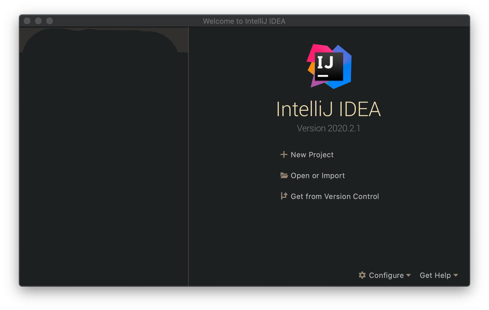
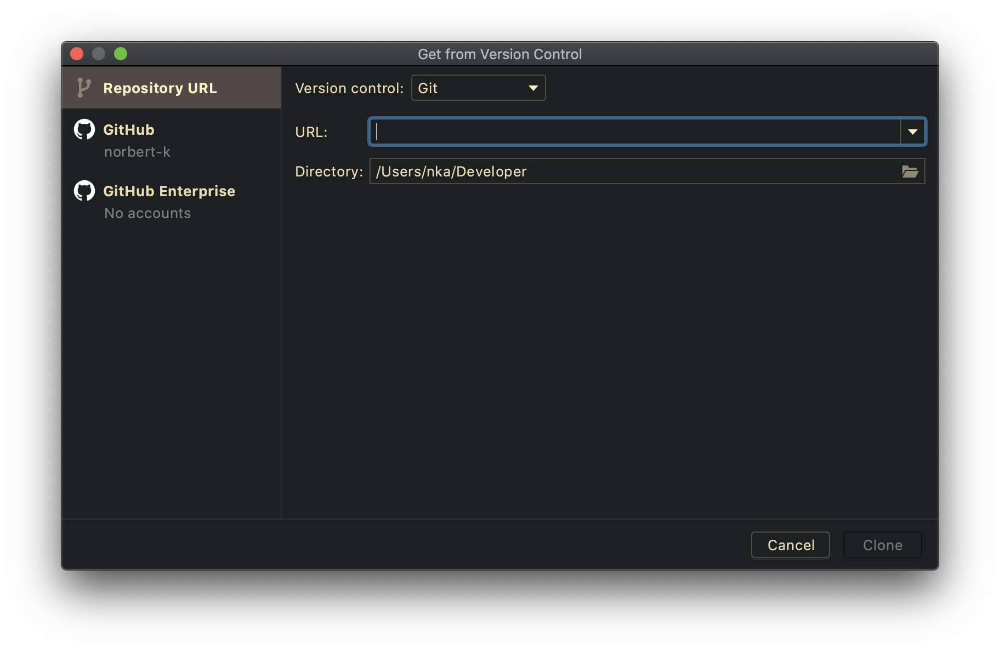
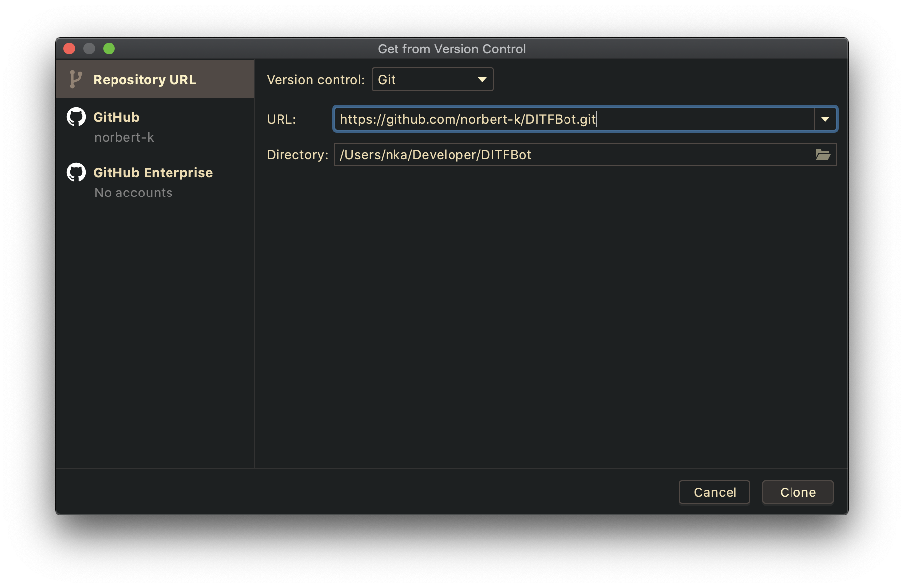

# _**DITFBot**_
_**RTU DITF Discord Bot**_

### Contributing

If you want to contribute to DITFBot, make sure to base your branch off of our development branch and create your PR into that same branch.

```
1) Create your own branch from development brach
    1.1) Name should be equal to Feature Request OR Bug fix name
2) Push changes to newly created branch
3) Create merge request to development branch and request code-review for merge request.
```

**DO NOT COMMIT PRIVATE KEY / SECRETS (for eg config.properties file with your personal keys)!!!**

#### Code review guidelines
* Code review goes through owner of repo.
* Comment only problematic parts of code.
* Include links if needed to documentation and/or external sources to guide person into proper code conventions/style.
* Merge requests only if tests complete (automatic CI/CD)

### Dependencies

This project requires Java 15+. (`openjdk`, `adoptopenjdk`)

* JDA
    * Gradle: `compile 'net.dv8tion:JDA:4.2.0_205'`
    * Version: 4.2.0_*

* Logback
    * Gradle: `compile 'ch.qos.logback:logback-classic:1.2.3'`
    * Version: 1.2.3
    
* JCommander
    * Gradle: `compile "com.beust:jcommander:1.71"`
    * Version: 1.71

* JUnit
    * Gradle: `testCompile group: 'junit', name: 'junit', version: '4.12'`
    * Version: 4.12

Dependencies are defined in `build.gradle` file and should be automatically downloaded when building project.

#### Setting up development environment

1) Download `openjdk`/`adoptopenjdk`
Guide: https://adoptopenjdk.net/installation.html?variant=openjdk15&jvmVariant=openj9#x64_linux-jdk

2) Dowload Jetbrains Intelij IDEA
* Use student discount here: https://www.jetbrains.com/community/education/ (with RTU .edu email)

3) Register github.com account

4) Download & set-up git with e-mail you used for github.com account:
https://git-scm.com/book/en/v2/Getting-Started-Installing-Git
Set-up email & name for git (use name & email from your github.com account):
```bash
git config --global user.name "John Doe"
git config --global user.email johndoe@example.com
```
5) Import DITFBot project in Intelij IDEA


Open Intelij IDEA


Click on `Get from Version control`


Enter repository URL: `https://github.com/norbert-k/DITFBot.git` and click Clone


**Done!**

### Maintainers

* Norberts Kakste [norbert-k](https://github.com/norbert-k)
* Jānis Bērziņš

### Related projects & documentation:

* JDA:
    * Github: https://github.com/DV8FromTheWorld/JDA
    * Documentation
        * Wiki: https://github.com/DV8FromTheWorld/JDA/wiki
        * Javadoc: https://ci.dv8tion.net/job/JDA/javadoc/

* JCommander:
    * Github: https://github.com/cbeust/jcommander
    * Documentation: https://jcommander.org

### Roadmap

- [x] Read config.properties file for discord bot specific information
- [ ] Automatic CI/CD (Continuous integration & continuous delivery)
- [ ] CLI Interface with JCommander
- [ ] Message handling architecture
- [ ] Generate an invitation link from CLI & print it out on Bot startup
- [ ] List all joined guilds on startup and while running
- [ ] Log every message with logger
- [ ] Ping <-> Pong message handler
- [ ] System information (!debuginfo) message handler (GC, CPU usage etc...)
- [ ] Extra message handler (custom messages, further review required!)
- [ ] Database access (read configuration from config.properties)
- [ ] Database migrations with flyway
- [ ] Log every message to database
- [ ] Simple VueJS based message viewer

### Feature list

#### CLI / Startup:
- [ ] Read config.properties config file for API keys & DB settings
- [ ] Interactive CLI with tab completion and --help support
- [ ] Pre startup health-checks

#### Integrations
- [ ] RTU Sudent Calendar (`.ics`) support
- [ ] Register users with RTU OAuth
- [ ] Message logging 

#### Quality control
- [ ] Tests
- [ ] Benchmarks
- [ ] Documentation

#### Ease of use
- [ ] Docker image
- [ ] Helm image
- [ ] `.deb`, `.rpm` etc.. packages
